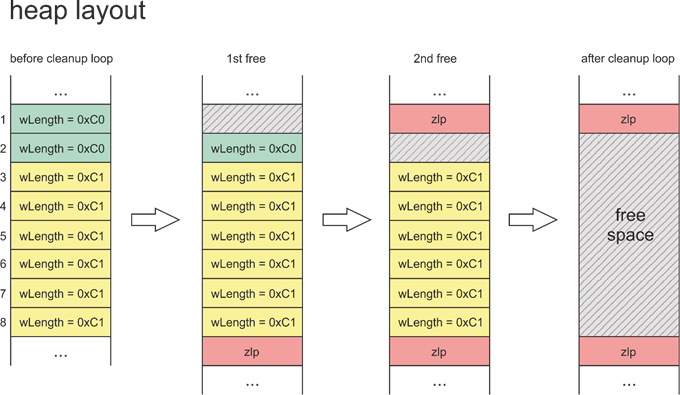
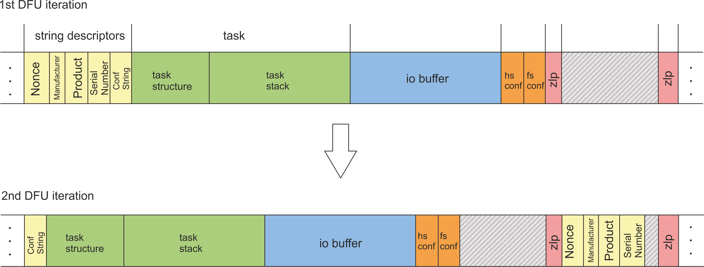

# checkm8 exploit & checkra1n jailbreak
#### Student seminar: security protocols and applications
#### 03/2020
##### Louis Merlin (247565)

## What is a jailbreak ?

Apple is known for its high hardware and software security. But every so often, a group of hackers and enthusiasts are able to crack the iPhone. A jailbreak typically involves some kind of privilege escalation on iOS, making the user root and able to bypass most of the OS's limitations.

A big usage of jailbreaking is for mobile carrier unlocking, if you wanted to switch your mobile carrier but your iPhone is locked with your current carrier. It is also used to install applications that are not on the Apple App Store, and tweak your device in different ways. It can also be used by security researchers to gain knowledge on the iPhone, iOS and apps.

Jailbreaks have played a big role in the iPhone from its beginning, as the first jailbreak was published only a few days after the release of the first iPhone in 2007. Since then, Apple has upgraded the security of the hardware and the software significantly. Many security researchers that find those jailbreaks end up working on security at Apple. Some current versions of iOS and iPhone have no public jailbreaks.

There are four types of jailbreaks : tethered, semi-tethered,  semi-untethered or untethered. Checkra1n is a semi-tethered jailbreak, which means you need to re-jailbreak your iPhone on every boot.

## 2. History

The exploit was first published in September 2019 by axi0mX in his tool ipwndfu, although littlelailo claimed to have discovered it in March and published it in a text file, apollo.txt. As we will see later, the exploit is not patcheable by Apple.

Over the months it was used to create a full jailbreak for iPhones 5s to X, named checkra1n.

## 3. Deep Dive

**SecureRom** is the very first part of the iPhone's boot process. It acts as the boot process for **iBoot**, which itself acts as the boot process for the **iOS kernel**. SecureRom is hard-coded in silicon, which is what makes the exploit unpatcheable.

The goal of SecureRom is to verify iBoot is valid and signed by Apple. It can be used to upload a new version of iBoot on the iPhone using the **USB DFU** (Device Firmware Upgrade) protocol.

### 3.1 - The Bug

The exploited bug is in this USB DFU protocol. When the protocol starts, and the device receives a `SETUP` packet that announces to the device the `length` of the upcoming data transmission. It then allocates an i/o buffer in the ram, and gives its address to the USB stack via a global variable. The USB code then proceeds to wait for the data coming from the computer.

Once the transfer is completed, the data is copied to the location where the boot will happen, the i/o buffer is freed, the image and its signature are verified, and iBoot starts if everything is ok. The signature is one of Apple's public keys, which are 2048-bit long RSA public keys.

On a USB interrupt, the image is verified like if the transfer had completed, but instead of booting the data (because it is not valid), the code then proceeds to wait for a new USB DFU transfer.

This is where the bug can happen : if instead of sending a new `SETUP` packet you start sending blobs of data, the data will be put at the location of the previous dangling pointer, that was freed but never nulled out. This is a **use-after-free** bug.

### 3.3 - A8 and A9 processors

The A8 and A9 processors are those used in the iPhone 6, 6+, 6s and 6s+. In those processors, the allocation code is such that the use-after-free directly overwrites the current USB task.

One thing to know about USB tasks in this situation : they are organized in a linked-list. So, although the current task's code is already on the CPU registers, the `next` pointer has not been evaluated yet. By overwriting this pointer with the one of a made-up task we just transfered onto memory, we can take complete control of the USB stack.

This is direct code execution, we could now move on to the actual payload. But it is not so simple for the other vulnerable processors.

### 3.4 - Other processors

Although the exploit does not gain access to a USB task, the ROM is still deterministic, and we can craft an interesting attack to gain direct code execution.

We will use a concept called **Heap Feng-Shui**. This is basically using the fact that the ROM is deterministic to craft holes and make sure important data is allocated where we have control. SecureRom will always try to allocate data in the smallest hole that fits.

Here is the code that creates this hole :

```python
# The 6th argument of those methods is the length of the
# data, or the data itself.

def stall(device):
  libusb1_async_ctrl_transfer(device, 0x80, 6, 0x304,
                              0x40A, 'A' * 0xC0, 0.00001)
def leak(device):
  libusb1_no_error_ctrl_transfer(device, 0x80, 6, 0x304,
                                 0x40A, 0xC0, 1)
def no_leak(device):
  libusb1_no_error_ctrl_transfer(device, 0x80, 6, 0x304,
                                 0x40A, 0xC1, 1)

stall(device)
leak(device)
for i in range(6):
    no_leak(device)
dfu.usb_reset(device)
dfu.release_device(device)
```

There is a leak of a data structure allocated in memory but never freed for the `stall` and `leak` calls. This data structure corresponds to the USB task of sending a zero-length-packet (zlp). This is another bug in the SecureRom code. Requests that are not a multiple of 64 bytes do not trigger this leak.

We create requests that are exactly (`0xC0`) or approximately (`0xC1`) the size of a USB struct. We are able to create a hole that will be the preferred place to put newly allocated objects.





The next part of the exploit involves restarting DFU. By doing that, every allocated data listed in the graph bellow will be removed from the RAM, **except** our zlp packets. When the re-allocation takes place, the first chunks data will be allocated in our small hole that we have read access to.





We can now overflow to the `usb_device_io_request` pointer, and gain direct code execution.

### 3.5 - Payload

```
0x1800B0000: t8010_shellcode  # initializing shell-code
...
0x1800B0180: t8010_handler  # new usb request handler
...
0x1800B0400: 0x1000006a5  # fake translation table descriptor
                          # matches the value in the original
                            translation table
...
0x1800B0600: 0x60000180000625  # fake translation table descriptor
                               # matches the value in the original
                                 translation table
0x1800B0608: 0x1800006a5  # fake translation table descriptor
                          # plus, in this descriptor,there are rights
                            for code execution
0x1800B0610: disabe_wxn_arm64  # code for disabling WXN
0x1800B0800: usb_rop_callbacks  # callback-chain
```
Next, we send the payload. Its sole job is to redefine as many critical values as possible, and then jump to the callback-chain.

An interesting line is the `disable_wxn_arm64`. This disables "Write permission implies Execute Never", and enables us to execute code in RW memory.

We now restore the USB configuration to regain access to the device from the outside. The shellcode then overwrites a few values to tell the hacker that the execution was successful. Namely, the USB serial number is replaced with "PWND:[checkm8]". In the end, it replace the USB request handler pointer. Finaly, it initiate a new USB transfer for the bootkit to load and execute.

### 3.6 - The Bootkit

What we want to do is boot normally and compromise the boot stages one after the other.

**But** iBoot will reset all registers and wipe memory (what it calls a "trampoline"). The solution that was found is to hook bzero to avoid that. The bzero method (that changes all data to `\0` in specific memory space) is hooked into so that it never reaches our bootloader (it is transformed into a `NOP` in that case). This is a "hacky" way to do it according to the people who wrote it, but at least it has the advantage to work on all devices, and to be relatively short and simple.

We now have read-write access to the kernel in the ram, but not to the iPhone's memory. In order to retain code execution in usermode, we can embed a tiny (and fake) ramdisk in the shellcode, in order to hijack root code execution once the phone is booted. The system will now fork(2) off right as it is booting iOS. In this fork we can launch an SSH daemon to get remote access to the system, and we can also load custom .app files to be installed on the system.

# 4. Conclusion
This was big news in the jailbreaking community, as the latest full jailbreak was on iOS 8 (2014). This will enable researchers to do security research on iOS and the iPhone for the next few years. Jailbreaking is the only way to do binary analysis on apps from the App Store. This can also lead to [dual booting](https://twitter.com/Basti564/status/1235316256024285184) with android for example, or even maybe Linux on the iPhone.

#### Illustrations and content
- https://habr.com/en/company/dsec/blog/472762
- https://media.ccc.de/v/36c3-11238-the_one_weird_trick_securerom_hates

